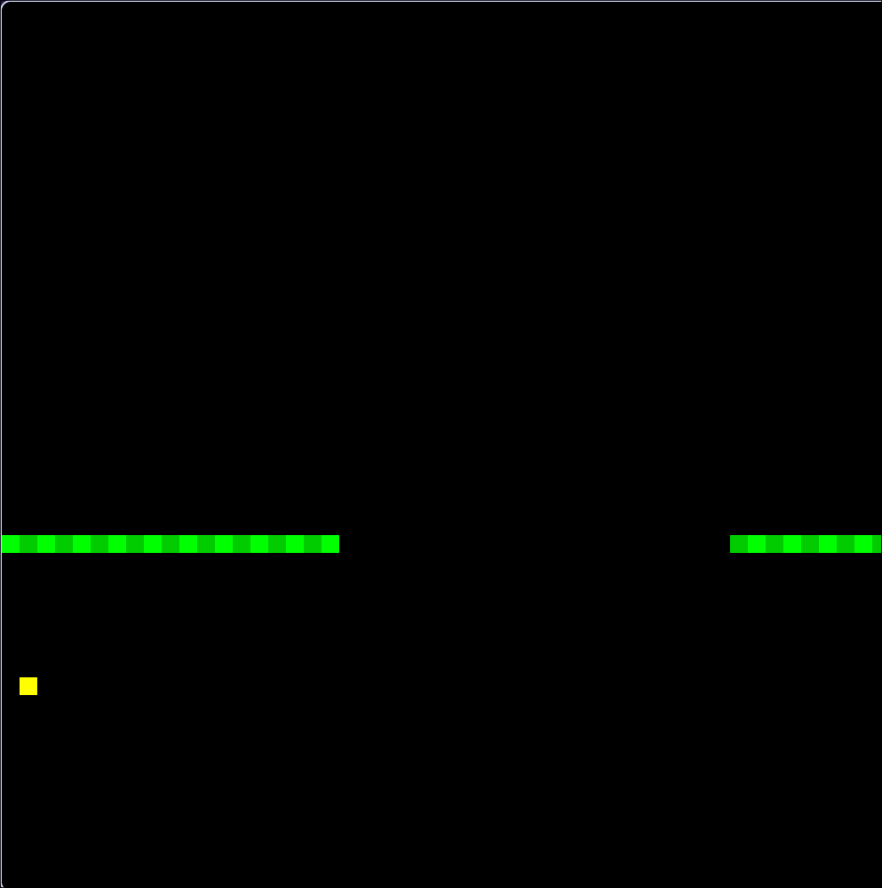
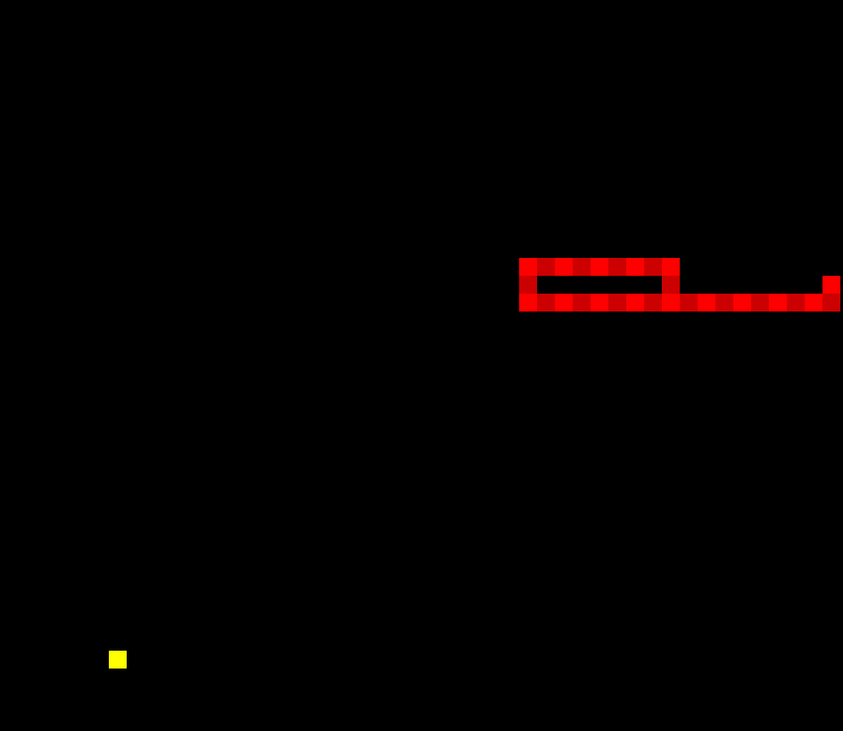

# 🐍 Snake Game (C++ + OpenGL)

A simple snake game built using C++ and OpenGL and GLFW for rendering

## Requirements

- C++17+
- OpenGL
- GLFW
- GLEW

## Build instructions

### Linux

```bash
g++ -o snake_game src/main.cpp src/sound.cpp -lSDL2 -lGL -lGLEW -lGLFW
./snake
```




## How to Play
Use the arrow keys to control the snake and eat the fruit. Avoid hitting your own body!
